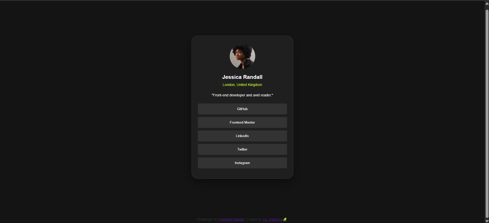
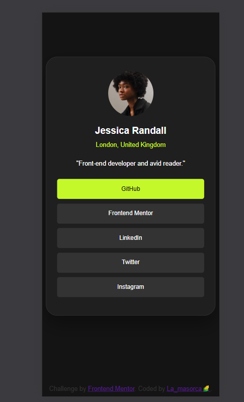
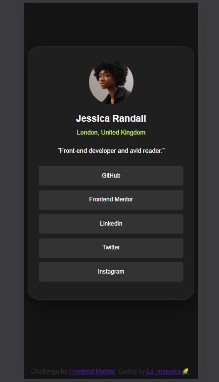

# Frontend Mentor - Social links profile solution

This is a solution to the [Frontend Mentor social links profile challenge](https://www.frontendmentor.io/challenges/social-links-profile-UG32l9m6dQ). Frontend Mentor challenges help improve your coding skills by building realistic projects.

## Table of contents

- [Summary](#summary)
  - [The challenge](#the-challenge)
  - [Screenshot](#screenshot)
  - [Links](#links)
- [My process](#my-process)
  - [Built with](#built-with)
  - [What I learned](#what-i-learned)
  - [Continued development](#continued-development)
  - [AI collaboration](#ai-collaboration)
- [Author](#author)
- [Acknowledgements](#acknowledgements)


## Overview

### The challenge

Users should be able to:

- See hover and focus states for all interactive elements on the page

### Screenshot







### Links

- Solution URL: [Add your solution URL here](https://your-solution-url.com)

## My process

### Built with

- Semantic HTML5 markup
- Custom CSS
- Mobile-first workflow

### What I learned

I learned a better way to use `<div>` containers to create sections and organize the page. I also learned when to place buttons more interactively so the layout looks cleaner and matches the design better.

To see how you can add code snippets, check below:

```html
<div class="profile-card">
  <h1>Some HTML code I'm proud of</h1>
</div>
```
```css
button:hover {
  color: hsl(0, 0%, 8%);
}
```

### Continued development

I need to keep practicing both CSS and HTML5 to improve my workflow on future projects, learning the purpose of each CSS property and how to use HTML5 correctly.

### AI collaboration

- What tools did you use?

I used GitHub Copilot because it was easier to apply from Visual Studio Code.

- How did you use them (for example, debugging, generating standard text, brainstorming solutions)?

I used it to get small hints for parts of the index.html and the CSS.

- What worked well? What didn't?

The button color styling worked well because I did not know how to do it, and another button feature did not work so I decided to exclude it since it did not match the design of the project.

## Author

- Website - [Frontend Mentor](https://www.frontendmentor.io/?ref=challenge)
- Frontend mentor - [La_masorca🌽](https://www.frontendmentor.io/profile/agenteelite)

## Acknowledgements

I am very grateful to have found this site because it helps me progress in my career and gives me practice for future projects. I appreciate it from the bottom of my heart.